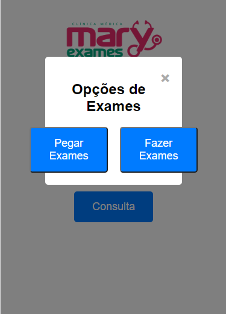

# Mary Exames

## Descrição
O Mary Exames é um sistema de geração de senhas desenvolvido para clínicas médicas. Ele permite que os clientes gerem senhas para diferentes serviços, como Recepção, Exames e Consulta, facilitando o atendimento e organização da clínica.

## Tecnologias Utilizadas
- HTML
- CSS
- JavaScript

## Funcionalidades
- Geração de senhas para Recepção, Exames e Consulta
- Modal para opções de Exames e Consulta
- Interface amigável e responsiva

## Como Utilizar
1. Clone o repositório.
2. Abra o arquivo `index.html` em um navegador web.
3. Clique nos botões correspondentes aos serviços desejados para gerar uma senha.
4. Em caso de Exames ou Consulta, utilize o modal para escolher entre as opções disponíveis.

## Evolução Futura
- Implementação de um banco de dados para armazenar as senhas geradas.
- Adição de funcionalidades de agendamento de consultas.
- Melhorias na interface gráfica e experiência do usuário.
- Suporte para múltiplos usuários e gerenciamento de filas de atendimento.

## Contribuições
Contribuições são bem-vindas! Se você tem sugestões de melhorias, correções de bugs ou novas funcionalidades, sinta-se à vontade para abrir uma issue ou enviar um pull request.

## Capturas de Tela
Aqui estão algumas capturas de tela do sistema:

### Tela Inicial

### Modal de Opções de Exames

